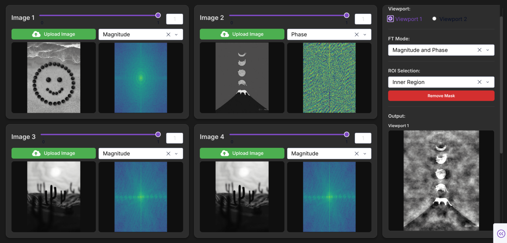

# Fourier Transform Mixer

A web application for mixing images using Fourier Transform. Upload up to 4 grayscale images, visualize their frequency components, and create mixed images by combining magnitude/phase or real/imaginary parts.



## What It Does

This app lets you:
- Upload up to 4 grayscale images
- View Fourier Transform components (Magnitude, Phase, Real, Imaginary)
- Mix images by combining different frequency components with adjustable weights
- Apply region-based filtering to select specific frequency ranges
- Generate mixed output images in real-time

## How to Run

1. **Install dependencies:**
```bash
pip install -r requirements.txt
```

2. **Run the application:**
```bash
python app.py
```

3. **Open in browser:**
```
http://localhost:8050
```

## Requirements

- Python 3.8+
- dash==2.14.2
- plotly==5.18.0
- numpy==1.24.3
- Pillow==10.1.0

## How to Use

1. **Upload Images**: Click "Upload Image" on any of the 4 cards and select grayscale images
2. **Set Weights**: Adjust sliders (0-1) for each image to control mixing strength
3. **Choose Mode**: Select "Magnitude and Phase" or "Real and Imaginary" mode
4. **Select Components**: Choose which FT component to use from each image
5. **Apply Regions** (Optional): Draw rectangles on FT displays to filter frequencies
   - Inner Region: Keeps low frequencies (smooth features)
   - Outer Region: Keeps high frequencies (edges, details)
6. **Mix**: Click "Mix" button and view output in selected viewport

## Features

- **4 Input Images**: Upload and mix up to 4 images simultaneously
- **Dual Output Viewports**: Generate two different mixes for comparison
- **Interactive Brightness/Contrast**: Drag on images to adjust display
- **Region Masking**: Draw rectangles to select frequency ranges
- **Real-time Progress**: Progress bar shows mixing status
- **Auto-sizing**: Images automatically unified to smallest dimensions

## License

MIT License - see [LICENSE](LICENSE) file